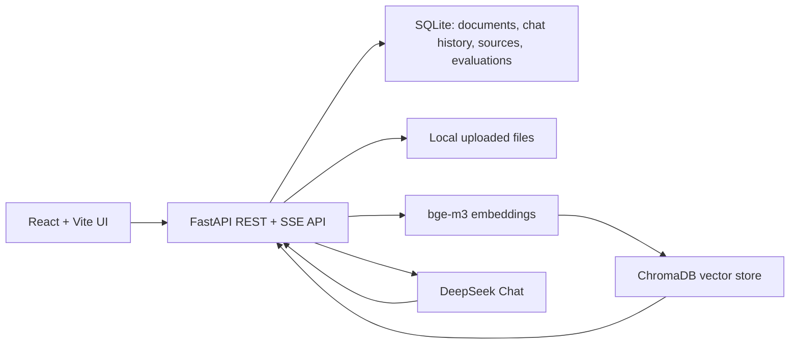

# RAG Knowledge Base

一个面向本地演示和简历展示的 RAG 文档问答项目。项目以 FastAPI 后端为核心，支持上传 PDF/TXT/Markdown 文档、切分文本、生成向量、语义检索，并用 DeepSeek Chat 基于检索结果生成带来源引用的回答。

English positioning: Local RAG knowledge base demo.

## 项目定位

这个项目不是企业级知识库系统，而是一个完整、可运行、可讲清楚工程取舍的本地 RAG demo。

当前重点：

- 保持本地单机可运行。
- 保持架构实用，避免过早引入复杂基础设施。
- 用可重复的离线评估证明检索质量变化。
- 用中文 React 界面展示上传、检索、问答、引用、历史记录和本地数据管理。
- 用 README 作为简历和作品集入口。

## 技术栈

- Backend: FastAPI
- Frontend: React + Vite + TypeScript
- Vector Store: ChromaDB
- Business Data: SQLite + SQLAlchemy
- Embedding: `BAAI/bge-m3`
- LLM: DeepSeek Chat
- PDF Parsing: PyMuPDF
- Local Deployment Source: Docker Compose 配置已提供

## 当前状态

已完成的主要能力：

- Phase 1: 后端 RAG 闭环。
- Phase 2: React 前端本地演示流。
- Phase 3: 配置管理、SQLite 文档元数据、文档生命周期状态、Docker Compose 源码配置。
- Phase 4: RAG 离线评估、参数 sweep、检索默认值调优、reranker 对比评估。
- Phase 5: 异步文档处理、SSE 流式回答。
- Phase 6: 聊天历史、回答来源引用、评估记录、本地导出和安全清理持久化。
- Phase 7: 高压评估用例、query rewrite 对比、默认关闭的生产启发式 query rewrite、demo data seeding。

当前项目已进入结档/归档状态。近期不再进入新功能阶段；保留为实用、简历导向的本地 demo。

## 架构概览



核心流程：

1. 用户上传 PDF/TXT/Markdown。
2. 后端保存文件和 SQLite 文档元数据。
3. FastAPI `BackgroundTasks` 异步解析、切块、embedding，并写入 ChromaDB。
4. 用户提问时，后端先做向量检索。
5. 如果检索证据不足，直接返回 `根据当前知识库资料无法确定。`，不调用 LLM。
6. 如果证据足够，把检索上下文交给 DeepSeek Chat 生成回答。
7. 前端展示流式回答、去重后的来源引用、可展开 chunk 细节。
8. 聊天记录、回答来源引用和评估记录持久化到 SQLite。

## 后端运行

创建 Python 3.12 虚拟环境并安装依赖：

```powershell
py -3.12 -m venv backend\.venv
backend\.venv\Scripts\Activate.ps1
python -m pip install --upgrade pip
python -m pip install -r backend\requirements-dev.txt
```

配置 DeepSeek：

```powershell
Copy-Item backend\.env.example backend\.env
```

然后在 `backend\.env` 中设置真实的 `DEEPSEEK_API_KEY`。如果只运行后端测试，测试会使用 fake service，不需要真实 key。

启动后端：

```powershell
cd backend
.\.venv\Scripts\python.exe -m uvicorn app.main:app --host 127.0.0.1 --port 8000
```

健康检查：

```text
GET http://127.0.0.1:8000/health
```

运行后端测试：

```powershell
backend\.venv\Scripts\python.exe -m pytest -q
```

最近验证结果：

```text
92 passed, 5 warnings
```

## 前端运行

安装依赖：

```powershell
cd frontend
npm.cmd install
```

启动前端：

```powershell
cd frontend
npm.cmd run dev -- --host 127.0.0.1
```

打开页面：

```text
http://127.0.0.1:5173/
```

运行前端检查：

```powershell
cd frontend
npm.cmd run test
npm.cmd run build
npm.cmd run lint
```

最近验证结果：

```text
frontend tests: 17 passed
build: passed
lint: passed
```

## 本地 Demo Checklist

为了避免本地 SQLite 文档记录和 ChromaDB 向量数据不同步，演示前建议先重建 demo 数据。

从 `backend/` 运行：

```powershell
.\.venv\Scripts\python.exe -m app.cli.seed_demo_data --reset-documents
```

这个命令会从 `backend/evaluation/fixtures/documents` 重建：

- 本地 demo 文档文件。
- SQLite 文档元数据。
- ChromaDB 向量索引。

推荐演示流程：

1. Seed demo data。
2. 启动 backend。
3. 启动 frontend。
4. 验证后端和前端可访问：

```powershell
Invoke-WebRequest -Uri "http://127.0.0.1:8000/health" -UseBasicParsing
Invoke-WebRequest -Uri "http://127.0.0.1:5173/" -UseBasicParsing
```

5. 在前端提问固定 demo 问题，例如：

```text
向量库先保留哪个？
```

6. 展示流式回答、来源引用展开、检索调试面板和本地数据面板。

可选：如果要展示 Phase 7 query rewrite 对短问题检索的改善，可以在启动后端前临时设置：

```text
RAG_QUERY_REWRITE_ENABLED=true
```

默认保持 `false`。这个能力只改变 retrieval query，不改变发送给 LLM 的原始用户问题，也不改变聊天历史里保存的问题。

## Demo 截图

本项目的截图建议在演示前按 `本地 Demo Checklist` 重新生成，避免提交过期运行态图片。当前推荐截图路径：

```text
C:\Users\Leezhaoji\AppData\Local\Temp\rag-closeout-screenshots\desktop.png
C:\Users\Leezhaoji\AppData\Local\Temp\rag-closeout-screenshots\mobile.png
```

截图应覆盖：文档列表、流式回答、引用来源展开、检索详情和本地数据面板。

## 主要 API

文档：

```text
POST   /api/documents/upload
GET    /api/documents
DELETE /api/documents/{document_id}
```

检索和问答：

```text
POST /api/search
POST /api/chat
POST /api/chat/stream
```

聊天历史：

```text
GET    /api/chat/sessions
GET    /api/chat/sessions/{session_id}
DELETE /api/chat/sessions/{session_id}
```

评估记录：

```text
GET /api/evaluations
GET /api/evaluations/{run_id}
```

本地数据：

```text
GET  /api/admin/export
POST /api/admin/reset
```

## 文档生命周期

文档状态包括：

- `uploaded`: 文件已保存，等待后台处理。
- `indexed`: 文档已解析、切块、写入向量库。
- `failed`: 后台处理失败。
- `deleted`: 已删除，普通文档列表不再展示。

删除文档时，后端会保持三类数据一致：

- SQLite 文档元数据标记为 `deleted`。
- 本地上传文件删除。
- ChromaDB 中对应 `document_id` 的向量删除。

## RAG 评估

运行默认离线评估：

```powershell
cd backend
.\.venv\Scripts\python.exe -m evaluation.evaluate_retrieval
```

保存评估结果到 SQLite：

```powershell
cd backend
.\.venv\Scripts\python.exe -m evaluation.evaluate_retrieval --save-run
```

评估指标：

- `source_hit_rate`: 预期来源文件是否出现在检索结果中。
- `marker_hit_rate`: 预期证据文本是否出现在检索 chunk 中。
- `refusal_accuracy`: 无关问题是否被正确判定为证据不足。

参数 sweep：

```powershell
cd backend
.\.venv\Scripts\python.exe -m evaluation.evaluate_retrieval --chunk-sizes 400,800,1200 --chunk-overlaps 0,80,120 --top-ks 3,5 --min-relevance-scores 0.45,0.5,0.55
```

当前默认检索参数来自早期 sweep 结果：

```text
chunk_size=400
chunk_overlap=0
top_k=3
min_relevance_score=0.45
```

Phase 7 的 20 条评估用例覆盖短问题、精确关键词、追问式表达、无关问题拒答和高级 RAG 边界。当前基线结果：

```text
source_hit_rate: 1.0
marker_hit_rate: 0.85
refusal_accuracy: 1.0
```

启发式 query rewrite 对比结果：

```text
source_hit_rate: 1.0
marker_hit_rate: 0.90
refusal_accuracy: 1.0
```

结论：query rewrite 有窄范围收益，但生产路径默认关闭。当前不接入 Qdrant、hybrid search 或 multi-turn RAG。

## Docker Compose

项目包含 Docker Compose 源码配置：

```powershell
docker compose config --quiet
```

最近验证：

```text
compose config: passed
```

Docker runtime build/up 当前跳过。原因是本地 Docker Hub/auth/registry 访问和 mirror 构建尝试曾多次超时。除非明确需要，不继续排障 Docker runtime。

## 工程亮点

- 后端优先实现完整 RAG 闭环：上传、解析、切块、embedding、检索、生成和引用。
- SQLite 存业务数据，ChromaDB 存向量数据，职责清晰。
- 文档生命周期状态可观察，删除流程同时清理元数据、文件和向量。
- 异步文档处理使用 FastAPI `BackgroundTasks`，避免过早引入 Celery/Redis。
- 低相关度拒答在调用 LLM 前执行，减少弱证据回答。
- SSE 流式回答提升本地 demo 观感。
- 聊天历史、回答来源引用和评估结果持久化到 SQLite。
- 离线评估和参数 sweep 让检索调优基于数据，而不是凭感觉。
- Demo data seeding CLI 让本地演示可以重复重建。
- Query rewrite 默认关闭、可观测、可评估，避免把实验能力包装成确定收益。

## 关键取舍

- 保留 ChromaDB，不迁移 Qdrant：当前本地 demo 场景足够，迁移收益不足。
- 不做 auth/权限系统：项目定位是本地演示，不扩成企业系统。
- 不做 agent tools、multimodal、microservice split：避免偏离 RAG 知识库主线。
- 不接入生产 reranker：离线对比没有带来指标提升。
- 不默认开启 query rewrite：它对短问题有帮助，但收益范围有限。
- Docker 源码配置保留，runtime build/up 暂停排障。

## 简历表述参考

- 构建了一个本地 RAG 知识库应用，技术栈包括 FastAPI、React、ChromaDB、SQLite、DeepSeek Chat 和 `bge-m3`。
- 实现了文档上传、异步索引、语义检索、低置信拒答、流式回答、聊天历史持久化和可展开来源引用。
- 建立了可重复的 RAG 离线评估体系，用 source hit、marker hit 和 refusal accuracy 衡量检索质量，并据此调优默认参数。
- 处理了文档生命周期一致性，保证 SQLite 元数据、本地文件和向量库数据在删除和失败场景下保持一致。
- 增加了默认关闭的 query rewrite 实验路径和 demo data seeding CLI，让本地演示可复现、可解释。
